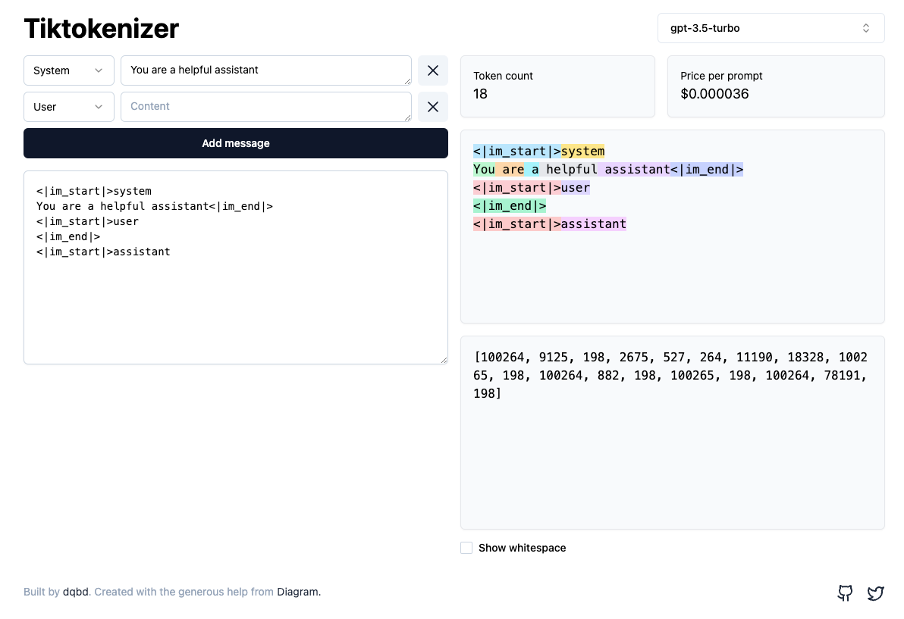

# gpt-tokens

[](https://www.typescriptlang.org/)

> GPT tokens / price Calculate

## Install

```bash
# npm or yarn

npm install gpt-tokens
yarn add gpt-tokens
```

### Usage

```typescript
import { GPTTokens } from 'gpt-tokens'

const usageInfo = new GPTTokens({
    // Plus enjoy a 25% cost reduction for input tokens on GPT-3.5 Turbo (0.0015 per 1K input tokens)
    plus    : false,
    model   : 'gpt-3.5-turbo',
    messages: [
        {
            'role'   : 'system',
            'content': 'You are a helpful assistant',
        },
        {
            'role'   : 'user',
            'content': '',
        },
    ]
})

// Tokens: 18
console.log('Tokens:', usageInfo.usedTokens)
// Price USD: 0.000036
console.log('Price USD: ', usageInfo.usedUSD)
```

You can test in [Tiktokenizer](https://tiktokenizer.vercel.app/)

* All tokens calculation is consistent
* The USD calculation of gpt-4 series models is inconsistent (Tiktokenizer does not distinguish between Prompt and Completion fees)



## Support Models

* gpt-3.5-turbo
* gpt-3.5-turbo-0301
* gpt-3.5-turbo-0613
* gpt-3.5-turbo-16k
* gpt-4
* gpt-4-0314
* gpt-4-32k
* gpt-4-32k-0314

## For web

If you use vite, need do this in `vite.config.js`

```javascript
import wasm             from 'vite-plugin-wasm'
import topLevelAwait    from 'vite-plugin-top-level-await'
import { defineConfig } from 'vite'

export default defineConfig({
    plugins: [wasm(), topLevelAwait()],
})
```

## Compatibility

As the dependency @dqbd/tiktoken is a WASM library, you can find the compatibility methods in the [NPM Readme of @dqbd/titoken.](https://www.npmjs.com/package/@dqbd/tiktoken#compatibility)

## Dependencies

- OpenAI tiktoken (Python lib) [openai/tiktoken](https://github.com/openai/tiktoken)
- @dqbd/titoken (Typescript)  [dqbd/tiktoken](https://github.com/dqbd/tiktoken)
