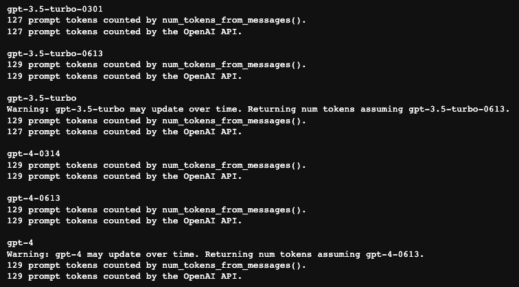

# gpt-tokens

[](https://www.typescriptlang.org/)

> GPT tokens / price Calculate

## Install

```bash
# npm or yarn

npm install gpt-tokens
yarn add gpt-tokens
```

### Usage

```typescript
import { GPTTokens } from 'gpt-tokens'

const usageInfo = new GPTTokens({
    model   : 'gpt-3.5-turbo-0613',
    messages: [
        {
            'role'   : 'system',
            'content': 'You are a helpful, pattern-following assistant that translates corporate jargon into plain English.',
        },
        {
            'role'   : 'system',
            'name'   : 'example_user',
            'content': 'New synergies will help drive top-line growth.',
        },
        {
            'role'   : 'system',
            'name'   : 'example_assistant',
            'content': 'Things working well together will increase revenue.',
        },
        {
            'role'   : 'system',
            'name'   : 'example_user',
            'content': 'Let\'s circle back when we have more bandwidth to touch base on opportunities for increased leverage.',
        },
        {
            'role'   : 'system',
            'name'   : 'example_assistant',
            'content': 'Let\'s talk later when we\'re less busy about how to do better.',
        },
        {
            'role'   : 'user',
            'content': 'This late pivot means we don\'t have time to boil the ocean for the client deliverable.',
        },
        {
            'role'   : 'assistant',
            'content': 'This last-minute change means we don\'t have enough time to complete the entire project for the client.',
        },
    ]
})

// ┌───────────────────┬────────┐
// │      (index)      │ Values │
// ├───────────────────┼────────┤
// │   Tokens prompt   │  129   │
// │ Tokens completion │   20   │
// │   Tokens total    │  149   │
// └───────────────────┴────────┘
console.table({
    'Tokens prompt'    : usageInfo.promptUsedTokens,
    'Tokens completion': usageInfo.completionUsedTokens,
    'Tokens total'     : usageInfo.usedTokens,
})

// Price USD:  0.000298
console.log('Price USD: ', usageInfo.usedUSD)
```

> Tokens calculation rules for prompt and completion:
>
> If the role of the last element of messages is not assistant, the entire messages will be regarded as a prompt, and **all content** will participate in the calculation of tokens
>
> If the role of the last element of messages is assistant, the last message is regarded as the completion returned by openai, and **only the 'content' content** in the completion participates in the calculation of tokens

Verify the function above in [openai-cookbook](https://github.com/openai/openai-cookbook/blob/main/examples/How_to_count_tokens_with_tiktoken.ipynb)



## Support Models

* gpt-3.5-turbo
* gpt-3.5-turbo-0301
* gpt-3.5-turbo-0613
* gpt-3.5-turbo-16k
* gpt-3.5-turbo-16k-0613
* gpt-4
* gpt-4-0314
* gpt-4-0613
* gpt-4-32k
* gpt-4-32k-0314
* gpt-4-32k-0613

Test in your project

```typescript
import { testGPTTokens } from 'gpt-tokens'

testGPTTokens('Your openai apiKey').then()

// [1/11]: Testing gpt-3.5-turbo-0301...
// Pass!
// [2/11]: Testing gpt-3.5-turbo...
// Warning: gpt-3.5-turbo may update over time. Returning num tokens assuming gpt-3.5-turbo-0613
// Pass!
// [3/11]: Testing gpt-3.5-turbo-0613...
// Pass!
// [4/11]: Testing gpt-3.5-turbo-16k...
// Warning: gpt-3.5-turbo-16k may update over time. Returning num tokens assuming gpt-3.5-turbo-16k-0613
// Pass!
// [5/11]: Testing gpt-3.5-turbo-16k-0613...
// Pass!
// [6/11]: Testing gpt-4...
// Warning: gpt-4 may update over time. Returning num tokens assuming gpt-4-0613
// Pass!
// [7/11]: Testing gpt-4-0314...
// Pass!
// [8/11]: Testing gpt-4-0613...
// Pass!
// [9/11]: Testing gpt-4-32k...
// Ignore model gpt-4-32k: Request failed with status code 404
// [10/11]: Testing gpt-4-32k-0314...
// Ignore model gpt-4-32k-0314: Request failed with status code 404
// [11/11]: Testing gpt-4-32k-0613...
// Ignore model gpt-4-32k-0613: Request failed with status code 404
// Test success!
// ✨  Done in 27.13s.
```

## Dependencies

- [js-tiktoken](https://github.com/dqbd/tiktoken)
